# Effective Sequence Length

<style>
.theorem, .definition {
  border-left: 4px solid #4f6f9f;
  padding: 0.75rem 1rem;
  margin: 1rem 0;
  background: #f7f9fc;
}
.definition {
  border-left-color: #608b4e;
  background: #f8fbf6;
}
.proof {
  border-left: 3px solid #aaa;
  padding: 0.5rem 1rem;
  margin: 1rem 0;
  background: #fafafa;
}
.figure-grid {
  display: grid;
  grid-template-columns: repeat(auto-fit, minmax(260px, 1fr));
  gap: 0.75rem;
  align-items: center;
  margin: 1rem 0;
}
.figure-grid img {
  width: 100%;
  height: auto;
}
img {
  max-width: 100%;
  height: auto;
  display: block;
  margin: 1rem auto;
}
table {
  border-collapse: collapse;
  margin: 1rem auto;
}
th, td {
  border: 1px solid #ddd;
  padding: 0.35rem 0.55rem;
  vertical-align: top;
}
</style>


<div class="definition" id="">

**Definition (Generalized effective sample size [Huggins and Roy, 2019; Martino et al., 2017]).** For normalized weights $\boldsymbol{w} = (w_1, \dots, w_n)$ with $w_i \ge 0$ and $\sum_{i=1}^n w_i = 1$, the generalized effective sample size (ESS) of positive order $\beta \in (0, 1) \cup (1, \infty)$ (Note: $\mathcal{E}_{\beta}$ with $\beta \in \left\{0, \infty\right\}$ are defined via limits [Van Erven and Harremoes, 2014], as for $\beta = 1$, but we do not discuss these two cases in detail in this report.) is defined as


```math align=center
\mathcal{E}_{\beta}(\boldsymbol{w}) = \left( \sum_{i=1}^{n} w_i^{\beta} \right)^{\frac{1}{1 - \beta}}.
```
For $\beta = 2$, this coincides with the classical ESS estimator used in importance sampling [Kong, 1992; Kong et al., 1994]. As $\beta$ tends to $1$, the generalized ESS tends to the perplexity [Cappe et al., 2008]:


```math align=center
\lim_{\beta \to 1} \mathcal{E}_{\beta}(\boldsymbol{w}) = \mathcal{E}_1(\boldsymbol{w})
        \coloneqq \exp\left( - \sum_{i=1}^{n} w_i \ln w_i \right).
```

</div>

<div class="definition" id="">

**Definition (Rényi divergence and Rényi entropy [Rényi, 1961]).** For a positive order $\beta \neq 1$, the Rényi divergence of a discrete probability distribution $\boldsymbol{p} = (p_1, \dots, p_n)$ from $\boldsymbol{q} = (q_1, \dots, q_n)$ is defined as


```math align=center
D_{\beta}(\boldsymbol{p} \parallel \boldsymbol{q})
        = \frac{1}{\beta - 1} \ln\left( \sum_{i=1}^{n} p_i^{\beta} q_i^{1 - \beta} \right).
```
The Rényi entropy is defined as


```math align=center
H_{\beta}(\boldsymbol{w}) = \frac{1}{1 - \beta} \ln\left( \sum_{i=1}^{n} w_i^{\beta} \right) = \ln\left( \mathcal{E}_{\beta}(\boldsymbol{w}) \right).
```
As $\beta$ tends to $1$, the Rényi divergence converges to the Kullback–Leibler (KL) divergence, and the Rényi entropy converges to the Shannon entropy.

</div>
Here we state, without proof, several facts concerning the generalized ESS and the Rényi divergence [Huggins and Roy, 2019; Van Erven and Harremoes, 2014; Martino et al., 2017]:


<div class="definition" id="">

**Fact (Bounds of ESS).** For any normalized weights $\boldsymbol{w} = (w_1, \dots, w_n)$ and $\beta \in (0, \infty)$, we have $1 \le \mathcal{E}_{\beta}(\boldsymbol{w}) \le n$. The lower bound is achieved if $\boldsymbol{w} = (\dots, 0, 1, 0, \dots)$ is a one-hot vector; and the upper bound is achieved if $w_i = 1/n,   \forall i \in \left\{1, \dots, n\right\}$.

</div>

<div class="definition" id="">

**Fact (Monotonicity of ESS).** For any normalized weights $\boldsymbol{w} = (w_1, \dots, w_n)$ and $0 < p \le q < \infty$, we have $\mathcal{E}_{q}(\boldsymbol{w}) \le \mathcal{E}_{p}(\boldsymbol{w})$.

</div>

<div class="definition" id="">

**Fact (Relationship between Rényi divergence and entropy).** The Rényi entropy can be expressed in terms of the Rényi divergence, $H_{\beta}(\boldsymbol{w}) = \ln n - D_{\beta}(\boldsymbol{w} \parallel \boldsymbol{u})$, where $\boldsymbol{u} = (1/n, \dots, 1/n)$ is the uniform distribution.

</div>

<div class="definition" id="">

**Fact (Relationship between ESS and Rényi divergence).** $\mathcal{E}_{\beta}$ can be expressed in terms of the Rényi divergence,


```math align=center
\mathcal{E}_{\beta}(\boldsymbol{w})
        = \exp\left( H_{\beta}(\boldsymbol{w}) \right)
        = \exp\left( \ln n - D_{\beta}(\boldsymbol{w} \parallel \boldsymbol{u}) \right)
        = n \exp\left(- D_{\beta}(\boldsymbol{w} \parallel \boldsymbol{u}) \right)
```
where $\boldsymbol{u} = (1/n, \dots, 1/n)$ is the uniform distribution.

</div>
In this report, we use the generalized ESS to quantify the effective sequence length induced by the attention mechanism for an input sequence of length $L$. We now define the effective sequence length for single-layer attention.


<div class="definition" id="">

**Definition (Effective sequence length).** Let $\lambda > 0$ be the scaling factor, and let $\boldsymbol{s} = (s_1, \dots, s_L)$ denote the logits for the last token $\boldsymbol{x}_L$. The attention weights $\boldsymbol{\alpha} = (\alpha_1, \dots, \alpha_L)$ are given by $\alpha_i = e^{\lambda s_i} / Z(\boldsymbol{s}; \lambda)$, where $Z(\boldsymbol{s}; \lambda) \coloneqq \sum_{i=1}^{L} e^{\lambda s_i}$ is the partition function. For $\beta \in (0, 1) \cup (1, \infty)$, the effective sequence length of single-layer attention is defined as


```math align=center
\mathcal{E}_{\beta}(\boldsymbol{\alpha}) 
        = \left( \sum_{i=1}^{L} \left( \frac{ e^{\lambda s_i} }{\sum_{j=1}^{L} e^{\lambda s_j}} \right)^{\beta} \right)^{\frac{1}{1 - \beta}}
        = \frac{\left( \sum_{i=1}^{L} e^{\lambda s_i} \right)^{\frac{\beta}{\beta - 1}}}{\left( \sum_{i=1}^{L} e^{\beta \lambda s_i} \right)^{\frac{1}{\beta - 1}}}
        = \frac{Z(\boldsymbol{s}; \lambda)^{\frac{\beta}{\beta - 1}}}{Z(\boldsymbol{s}; \beta \lambda)^{\frac{1}{\beta - 1}}}.
```
Define $\mathcal{E}_1(\boldsymbol{\alpha}) \coloneqq \lim_{\beta \to 1} \mathcal{E}_{\beta}(\boldsymbol{\alpha})$.

</div>
In Section 2.1, Section 2.2, we first assume $\lambda = 1$ (i.e., the scaling is absorbed into $\boldsymbol{s}$) and that the logits are deterministic. We then show that attention heads performing different tasks exhibit different scaling behavior in effective sequence length $\mathcal{E}_{\beta}$. Specifically, a retrieval head requires $\mathcal{E}_{\beta}$ to remain constant as $L$ increases (Theorem 1), whereas a global aggregation head requires $\mathcal{E}_{\beta}$ to scale linearly with $L$ (Theorem 2). In Section 3, we further discuss how the scaling factor $\lambda = \lambda(L)$, as a function of the context length, is determined by the scaling behavior of $\mathcal{E}_{\beta}$ (Theorem 3, Theorem 4).


<div id="sec:retrieval"></div>
## Retrieval Heads
A retrieval head is an attention head that implements a specific key–value matching rule and operates on the local context. Its output remains stable as long as the target is included in the context; increasing the context length therefore does not substantially affect the output.


**Problem Setup.** Consider a retrieval task on a sequence of length $n$, and extend the sequence to length $n+m$. Assume that the query vector for the last token remains unchanged. It then suffices to consider the logits $s_i$ and value vectors $\boldsymbol{v}_i$ for $i \in \left\{1, \dots, n+m\right\}$. The original attention output $\boldsymbol{o}_n$ is computed from the *signal* logit–value pairs $(s_i, \boldsymbol{v}_i)$ for $i \in \left\{1, \dots, n\right\}$. The extended output $\boldsymbol{o}_{n+m}$ additionally includes the *noise* pairs $(s_{n+j}, \boldsymbol{v}_{n+j})$ for $j \in \left\{1, \dots, m\right\}$. Our goal is to define a metric that quantifies the difference between $\boldsymbol{o}_{n+m}$ and $\boldsymbol{o}_n$; if this difference is small, the head's retrieval performance is preserved.

Let $\mathcal{E}_{\beta, n}$ and $\mathcal{E}_{\beta, n+m}$ denote the effective sequence lengths of the logits $(s_1, \dots, s_n)$ and $(s_1, \dots, s_{n+m})$, respectively, and define the relative change in $\mathcal{E}_{\beta}$ as


```math align=center
\Delta_{\beta} \coloneqq \frac{\mathcal{E}_{\beta, n+m}}{\mathcal{E}_{\beta, n}} - 1.
```
The following Theorem 1 shows that $\Delta_{\beta}$ provides a metric that bounds the difference $\| \boldsymbol{o}_{n+m} - \boldsymbol{o}_{n} \|$. Therefore, if $\mathcal{E}_{\beta}$ remains approximately constant across context lengths for some $\beta$, the behavior of single-layer attention under length generalization is approximately stable.

<div class="theorem" id="thm:ess retrieval">

**Theorem 1 ($\mathcal{E}_{\beta}$ as robustness metric).** Assume $\Delta_{\beta} > 0$ and that the vectors $\boldsymbol{v}_1, \dots, \boldsymbol{v}_{n+m}$ are uniformly bounded by an absolute constant. Then, for any $\beta > 0$, the attention output varies continuously with $\Delta_{\beta}$. Precisely, for any $\varepsilon > 0$, there exists $\delta > 0$ such that $\Delta_{\beta} < \delta$ implies $\| \boldsymbol{o}_{n+m} - \boldsymbol{o}_n \| < \varepsilon$. Moreover, there exist constants $\delta_{\beta}, C_{\beta} > 0$ depending only on $n, m, \beta$ such that if $\Delta_{\beta} < \delta_{\beta}$, then


1. If $\beta > 1$,
  
  
  $$
  \| \boldsymbol{o}_{n+m} - \boldsymbol{o}_n \| \le C_{\beta} \Delta_{\beta}.
  $$
2. If $\beta = 1$,
  
  
  $$
  \| \boldsymbol{o}_{n+m} - \boldsymbol{o}_n \| \le \frac{ C_{\beta} \Delta_{\beta}}{\ln(1/\Delta_{\beta})}.
  $$
3. If $0 < \beta < 1$,
  
  
  $$
  \| \boldsymbol{o}_{n+m} - \boldsymbol{o}_n \| \le C_{\beta} \Delta_{\beta}^{\frac{1}{\beta}}.
  $$

</div>

<details class="proof" open>
<summary><strong>Proof.</strong></summary>

We defer the proof to Proofs of Theorem 1 and Corollary 1.

</details>
Although the assumption $\Delta_{\beta} > 0$ may seem abstract, it is naturally satisfied in typical retrieval tasks where a small number of signal logits dominate. In this setting, $\mathcal{E}_{\beta, n} (= O(1)) \le \tilde{\mathcal{E}}_{\beta, m} (= \Theta(m))$, where $\tilde{\mathcal{E}}_{\beta, m}$ denotes the effective sequence length of the additional noise logits $(s_{n+1}, \dots, s_{n+m})$. We formalize this in Corollary 1.

<div class="theorem" id="cor:ess retrieval dominant">

**Corollary 1 (Robustness of retrieval heads with dominant signals).** Consider a retrieval task in which the signal is sufficiently dominant such that $\mathcal{E}_{\beta, n} \le \tilde{\mathcal{E}}_{\beta, m}$. Then $\Delta_{\beta} > 0$. Consequently, the output difference $\| \boldsymbol{o}_{n+m} - \boldsymbol{o}_n \|$ is bounded in terms of $\Delta_{\beta}$ as in Theorem 1.

</div>

<details class="proof" open>
<summary><strong>Proof.</strong></summary>

We defer the proof to Proofs of Theorem 1 and Corollary 1.

</details>

<div id="sec:aggregation"></div>
## Global Aggregation Heads
An aggregation head is an attention head that extracts global statistics or aggregates information across the full context. It must therefore attend broadly to all tokens and adapt to changes in context length.


**Problem Setup.** Consider a value-aggregation task on a sequence of length $n$. The aggregation rule depends on the positions of the values and is specified by a strictly positive probability density $p : [0, 1] \to (0, \infty)$ (e.g., $p \equiv 1$ corresponds to uniform averaging). The target attention output is the scale-invariant weighted average of the value vectors $\boldsymbol{v}_1, \dots, \boldsymbol{v}_n$:


```math align=center
\boldsymbol{o}_n^*
    = \sum_{i=1}^{n} \boldsymbol{v}_i \hat{\pi}_{n, i}
    \approx \int_{0}^{1} \boldsymbol{v}_{\left\lceil n x \right\rceil} p(x) \mathop{}\!\mathrm{d} x,
```
where $\hat{\pi}_{n, i} = p(i / n) / \sum_{j=1}^{n} p(j / n)$ are the weights of the discrete distribution induced by $p$. For each $n$, our goal is to approximate $\boldsymbol{o}_n^*$ using the single-layer attention output at the last token, $\boldsymbol{o}_n$. Equivalently, the attention weights should approximate the target weight vector $(\hat{\pi}_{n, 1}, \dots, \hat{\pi}_{n, n})$.

The following Theorem 2 shows that, to approximate global aggregation tasks within an $\varepsilon$ tolerance, $\mathcal{E}_{\beta}(\boldsymbol{\alpha})$ must grow linearly with the sequence length.

<div class="theorem" id="thm:ess aggregation">

**Theorem 2 ($\mathcal{E}_{\beta}$ scales in aggregation tasks).** Suppose the target density function $p: [0, 1] \to (0, \infty)$ is Riemann integrable. Let $\boldsymbol{\pi} = (\pi_1, \dots, \pi_n)$ be the target distribution induced by $p$, and let $\boldsymbol{\alpha} = (\alpha_1, \dots, \alpha_n)$ be the attention weight distribution for sequence length $n$. For any $\beta > 0$ and $\varepsilon > 0$, if $D_{\beta}(\boldsymbol{\alpha} \parallel \boldsymbol{\pi}) \le \varepsilon$, then $\mathcal{E}_{\beta}(\boldsymbol{\alpha}) = \Theta(n)$. Moreover, there exists a constant $C > 0$ depending only on $p$ such that


```math align=center
C e^{-\varepsilon} n \le \mathcal{E}_{\beta}(\boldsymbol{\alpha}) \le n.
```

</div>

<details class="proof" open>
<summary><strong>Proof.</strong></summary>

We defer the proof to Proof of Theorem 2.

</details>

## Visualizing the Effective Sequence Length
We evaluate a pretrained GPT-2 Small model using a local nanoGPT backend [Karpathy, 2022]. We extract causal attention weights from the model’s $c_{\mathrm{attn}}$ projections and compute position-wise $\mathcal{E}_{\beta}$ for each layer and head. We consider three prompt types:


- **Retrieval text**: person–city fact lookup; the final token queries a stored fact.
  
  
  ```text
  Directory lookup task. Each sentence says where one person lives. Use the sentences to answer the final question. 
  
  Fact 019: Xavier Reed has a home in Montreal. 
  
  Fact 000: Grace Reed lives in Copenhagen. 
  
  ... 
  
  Fact 081: Maya Diaz resides in Lisbon. 
  
  Fact 082: Elena Klein currently lives in Prague. 
  
  
   Extra lookup note 
  
  Question: Where does Xavier Reed live? 
  
  Answer:
  ```
- **Aggregation text**: movie-review sentiment; evidence must be aggregated across the context.
  
  
  ```text
  Movie sentiment aggregation task. Each review gives one opinion about the same movie. Estimate the overall sentiment from the collection of reviews. 
  
  Review 000: The movie is excellent and emotionally satisfying. 
  
  Review 001: The film is charming, warm, and easy to recommend. 
  
  ... 
  
  Review 063: The movie feels thoughtful, funny, and rewarding. 
  
  Review 064: The film is confusing, slow, and hard to recommend. 
  
  
   Additional 
  
  Overall sentiment:
  ```
- **Natural text**: OpenWebText snippets; a less synthetic baseline.

### Fixed $\beta = 2$, Varying Prompts.
We plot position-wise ESS curves at $\beta = 2$ for synthetic retrieval and aggregation prompts. Each panel covers all 12 layers and 12 heads; each heatmap reports the final-position ESS by layer and head. Attention-head behavior varies across prompt types, as indicated by the distribution of final-position ESS in Figure 1. As shown in Figure 2, Figure 3, ESS in shallow layers generally increases rapidly with sequence length $L$, whereas in deeper layers it increases slowly or remains approximately constant.


<div id="fig:gpt2_beta=2.0_heatmap"></div>
<div class="figure-grid">
  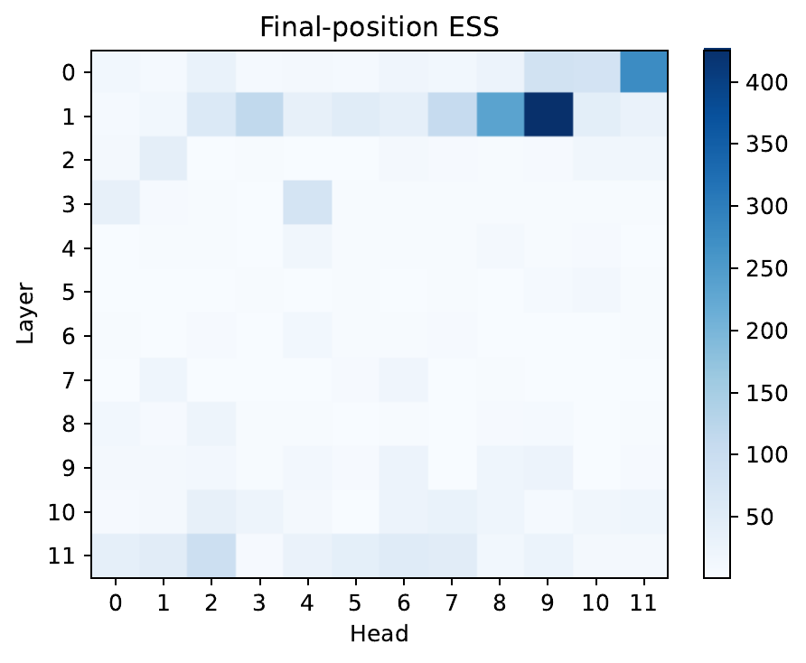
  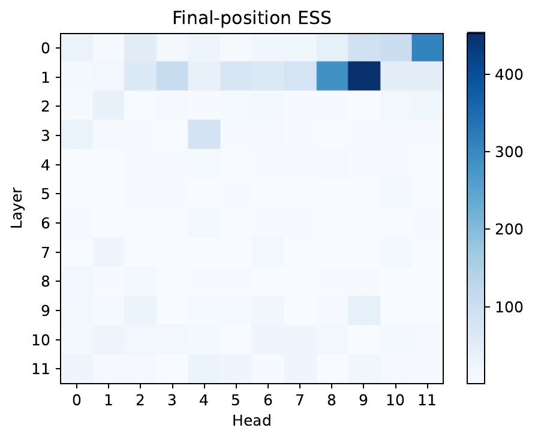
</div>

**Figure 1.** Final-position ESS heatmaps at $\beta = 2$: retrieval (left), aggregation (right).

<div id="fig:gpt2_retrieval_beta=2.0_ess_curve"></div>
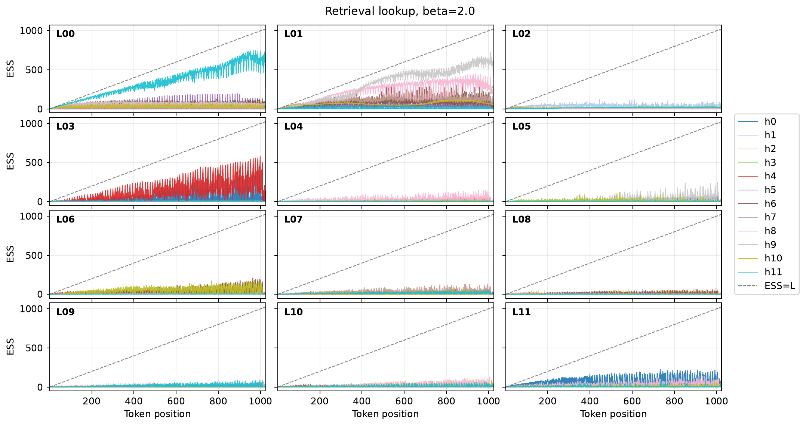

**Figure 2.** Retrieval text, $\beta = 2$: position-wise ESS curves.

<div id="fig:gpt2_aggregation_beta=2.0_ess_curve"></div>
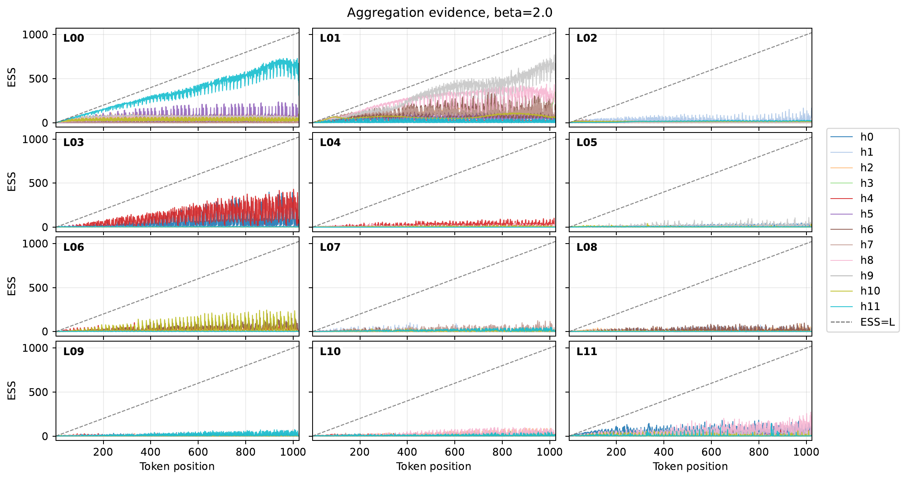

**Figure 3.** Aggregation text, $\beta = 2$: position-wise ESS curves.


### Natural Text, Varying $\beta$.
Because natural text is non-synthetic, it better reflects the ESS distribution of LLMs under realistic inputs than the other two settings. We fix the prompt and vary $\beta \in \left\{0, 0.5, 1, 2, \infty\right\}$ to study ESS behavior. As shown in Figure 4, Figure 5, Figure 6, Figure 7, Figure 8, Figure 9, the ESS curves decrease monotonically with increasing $\beta$, consistent with the monotonicity of $\mathcal{E}_{\beta}$. These results indicate that ESS is an informative metric for characterizing attention weights.


<div id="fig:gpt2_natural_beta=0.0_ess_curve"></div>
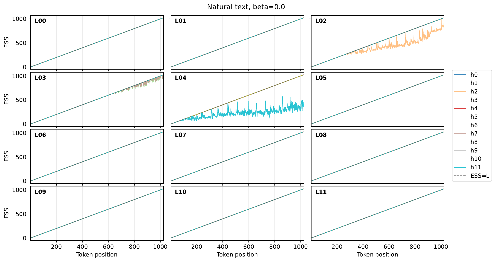

**Figure 4.** Natural text, $\beta=0$: position-wise ESS curves.

<div id="fig:gpt2_natural_beta=0.5_ess_curve"></div>
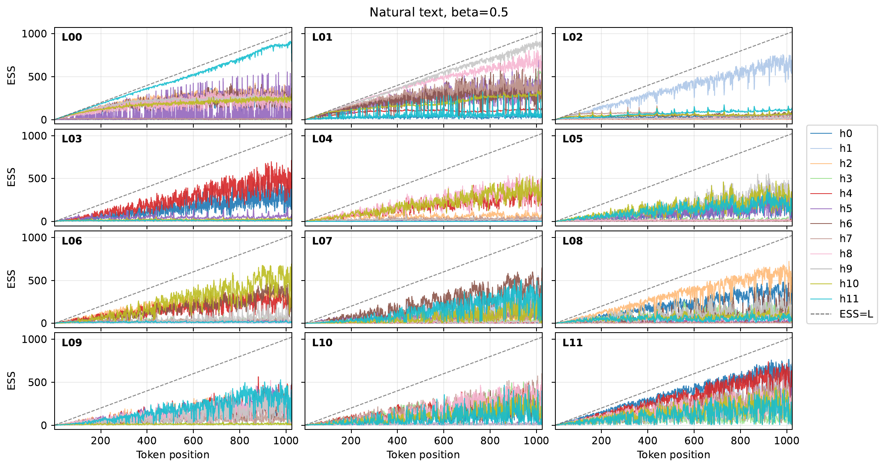

**Figure 5.** Natural text, $\beta=0.5$: position-wise ESS curves.

<div id="fig:gpt2_natural_beta=1.0_ess_curve"></div>
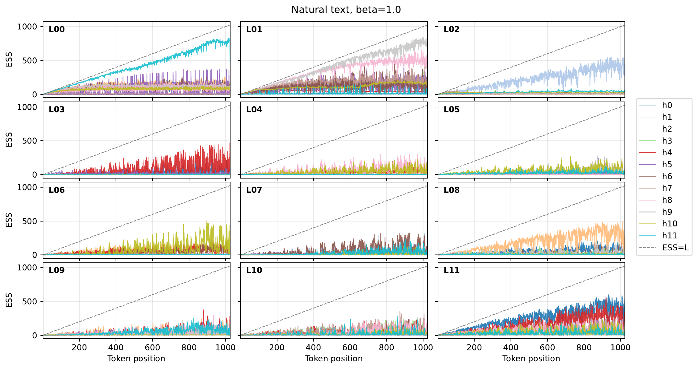

**Figure 6.** Natural text, $\beta=1$: position-wise ESS curves.

<div id="fig:gpt2_natural_beta=2.0_ess_curve"></div>
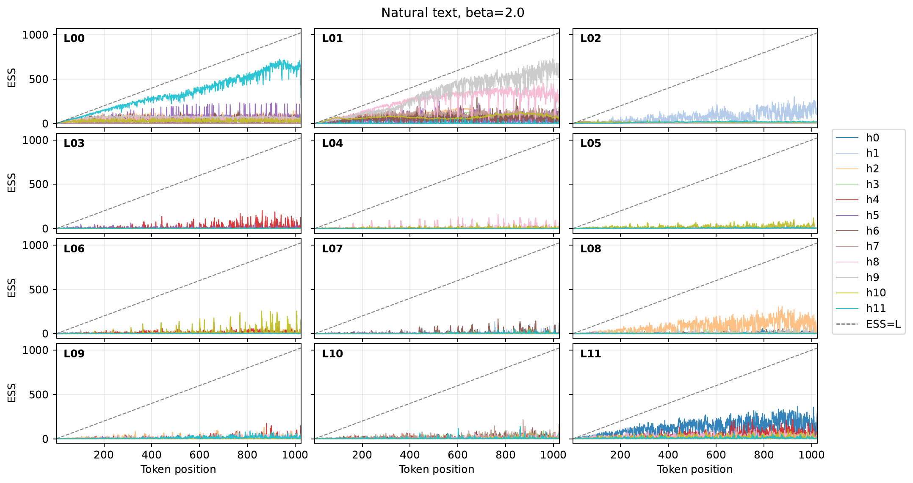

**Figure 7.** Natural text, $\beta=2$: position-wise ESS curves.

<div id="fig:gpt2_natural_beta=inf_ess_curve"></div>
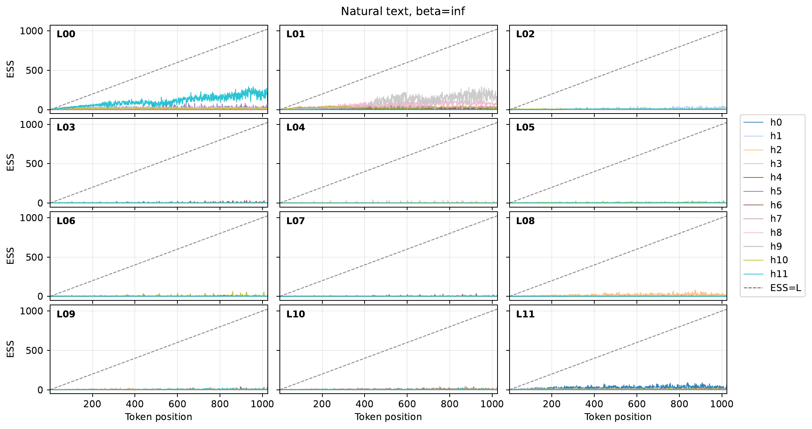

**Figure 8.** Natural text, $\beta=\infty$: position-wise ESS curves.

<div id="fig:gpt2_natural_heatmap"></div>
<div class="figure-grid">
  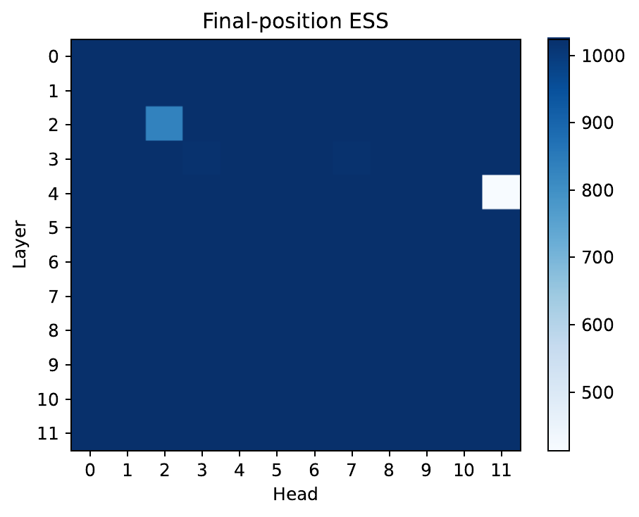
  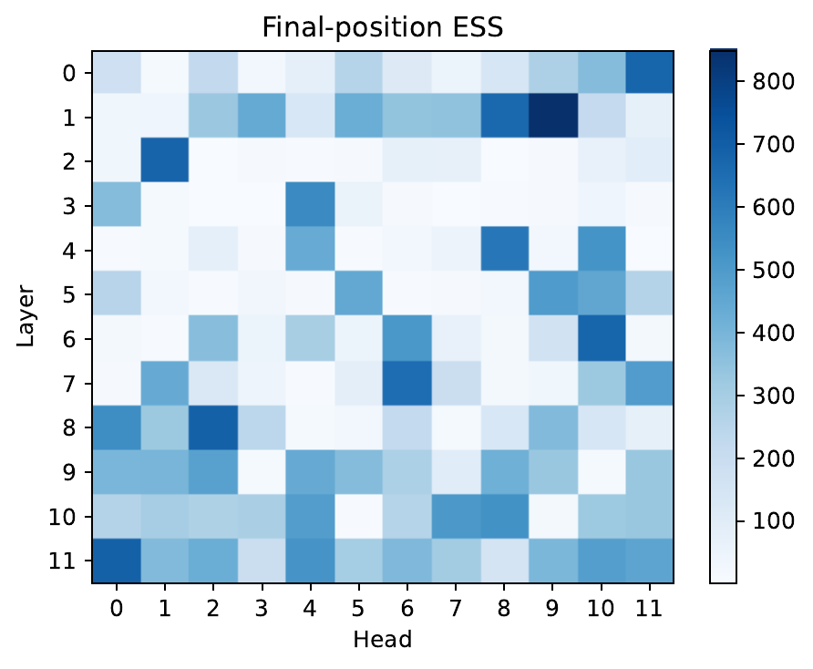
  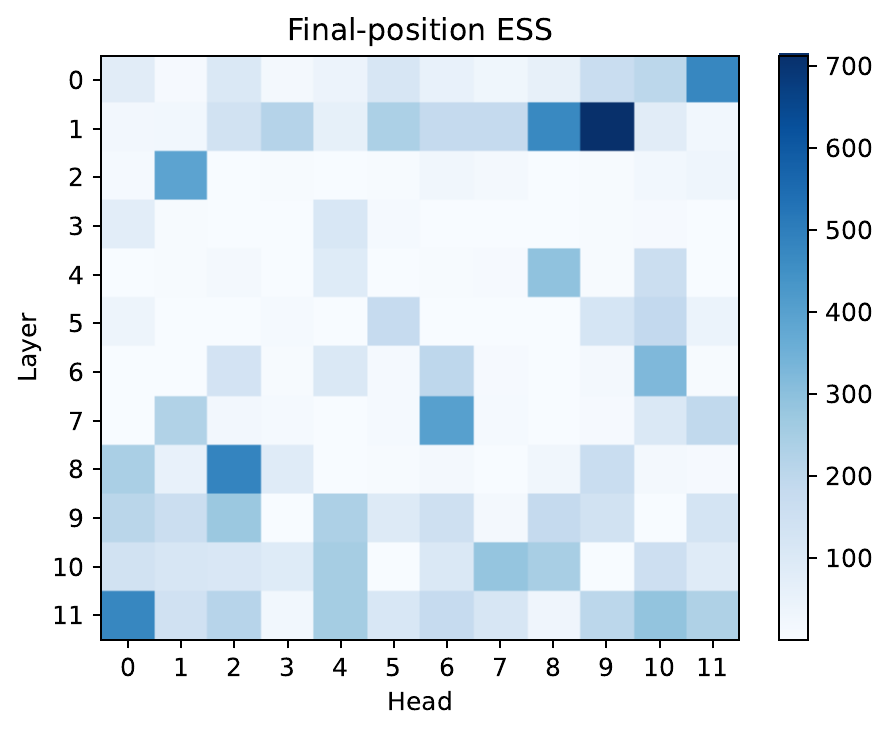
  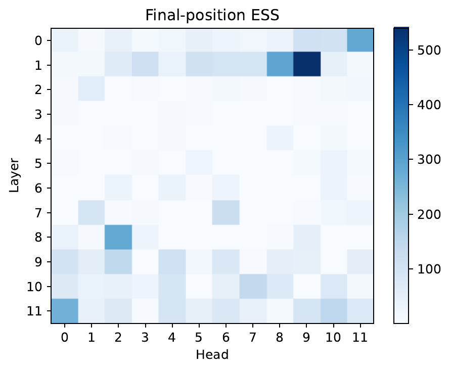
  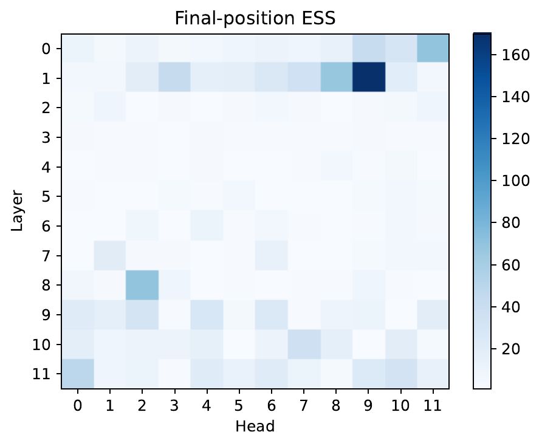
</div>

**Figure 9.** Natural final-position heatmaps at $\beta \in \left\{0, 0.5, 1, 2, \infty\right\}$.
