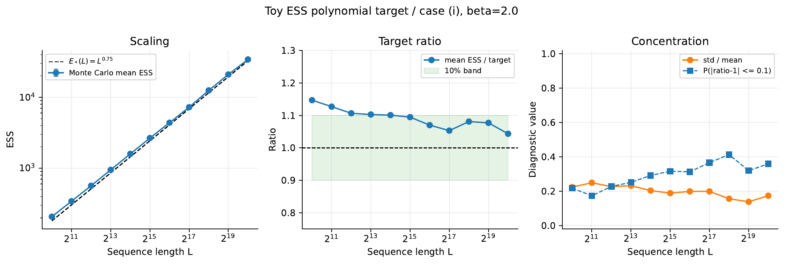
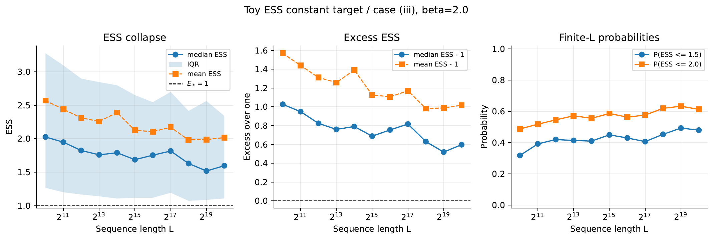
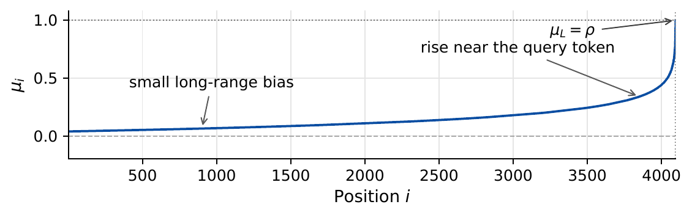

# Head-Aware Temperature Scaling

<style>
.theorem, .definition {
  border-left: 4px solid #4f6f9f;
  padding: 0.75rem 1rem;
  margin: 1rem 0;
  background: #f7f9fc;
}
.definition {
  border-left-color: #608b4e;
  background: #f8fbf6;
}
.proof {
  border-left: 3px solid #aaa;
  padding: 0.75rem 1rem;
  margin: 1rem 0;
  background: #fafafa;
}
.figure {
  margin: 1rem 0;
  text-align: center;
}
.figure img {
  max-width: 100%;
  height: auto;
  display: inline-block;
}
.caption {
  margin-top: -0.35rem;
  margin-bottom: 1.25rem;
  text-align: center;
  color: #555;
  font-size: 0.95rem;
}
.figure-grid {
  display: grid;
  grid-template-columns: repeat(auto-fit, minmax(260px, 1fr));
  gap: 0.75rem;
  align-items: center;
  margin: 1rem 0;
}
.figure-grid img {
  width: 100%;
  height: auto;
}
img {
  max-width: 100%;
  height: auto;
  display: block;
  margin: 1rem auto;
}
table {
  border-collapse: collapse;
  margin: 1rem auto;
}
th, td {
  border: 1px solid #ddd;
  padding: 0.35rem 0.55rem;
  vertical-align: top;
}
</style>

Motivated by Theorem 1, Theorem 2, we assume that each attention head performs a specific task (e.g., retrieval or aggregation) and is characterized by a head-specific $\beta > 0$. The task determines the desired behavior of $\mathcal{E}_{\beta}(\boldsymbol{\alpha})$ as the context length $L$ increases: $\mathcal{E}_{\beta}(\boldsymbol{\alpha})$ should remain approximately constant for a retrieval head (Theorem 1) and grow as $\Theta(L)$ for a global aggregation head (Theorem 2). By Definition 3, different scaling factors $\lambda$ can induce different asymptotic behaviors of $\mathcal{E}_{\beta}(\boldsymbol{\alpha})$. Consider $\beta = 2$ as an example. Suppose that $\boldsymbol{s} = (s_1, \dots, s_L)$ is a one-hot vector. Then


```math align=center
\begin{aligned}
        \mathcal{E}_2(\boldsymbol{\alpha}) 
        = \frac{\left( e^{\lambda} + L - 1 \right)^2}{e^{2 \lambda} + L - 1}
        = \frac{1 + 2 (L - 1) e^{-\lambda} + (L - 1)^2 e^{-2 \lambda}}{1 + (L - 1) e^{-2 \lambda}}
        \le 1 + 2 L e^{-\lambda} + L^2 e^{-2 \lambda}.
    \end{aligned}
```

If $e^{\lambda} = \Omega(L)$, then $\mathcal{E}_2(\boldsymbol{\alpha}) = O(1)$; in contrast, if $e^{\lambda} = O(1)$, then $\mathcal{E}_2(\boldsymbol{\alpha}) = \Theta(L)$. In this subsection, we consider a more general setting in which $\boldsymbol{s}$ is a random vector. Under this setting, we identify scaling factors $\lambda(L)$ for which $\mathcal{E}_{\beta}(\boldsymbol{\alpha})$ exhibits the prescribed asymptotic behavior (Theorem 3, Theorem 4).


**Problem Setup.** We consider a simplified model in which query and key vectors are correlated Gaussian distributed. Fix a context length $L$. Let $\boldsymbol{q} = (q_1, \dots, q_d)$ denote the query vector at position $L$, and assume $\boldsymbol{q} \sim \mathcal{N}(\boldsymbol{0}_d, \boldsymbol{I}_d)$. For each $i \in \left\{1, \dots, L\right\}$, the key vectors $\boldsymbol{k}_i = (k_{i, 1}, \dots, k_{i, d})$ are conditionally i.i.d. given $\boldsymbol{q}$, with $\boldsymbol{k}_i = \frac{1}{\sqrt{d}} \rho \boldsymbol{q} + \sigma \boldsymbol{z}_i$, where $\rho, \sigma > 0$ are constants and $\boldsymbol{z}_i \mathrel{\overset{\mathrm{iid}}{\sim}} \mathcal{N}(\boldsymbol{0}_d, \boldsymbol{I}_d)$.

In the following analysis, we investigate the relationship between the scaling factor $\lambda(L)$ and the effective sequence length $\mathcal{E}_{\beta}(\boldsymbol{\alpha})$. However, by Definition 3, $\mathcal{E}_{\beta}(\boldsymbol{\alpha})$ is a random variable (since the query and key vectors are random) and it would be more convenient to study its limiting behavior (as $d$ and $L$ approach infinity).

Note that our correlated Gaussian query–key setup corresponds to the Gaussian logits assumption in [Anson et al., 2025][^anson2025scale] as $d \to \infty$, and generalizes the independent query–key model that yields zero-mean logits [Barbero et al., 2025][^barbero2025round], thereby capturing effects beyond the initialization regime.


## Infinite-Width Limit of Gaussian Logits
Under this model, we first show in Proposition 1 that the attention logits jointly converge to a multivariate normal distribution with diagonal covariance. In the NoPE case the logits are asymptotically i.i.d.; in the RoPE case the limiting mean depends on the token position.

<div class="theorem" id="pro:clt logits">

**Proposition 1 (Infinite-width limit of logits).** Let $\theta_f$, $f \in \left\{0, \dots, d/2-1\right\}$ denote the rotation frequencies. Then


```math align=center
(s_1, \dots, s_L) \overset{\mathcal{D}}{\longrightarrow} \mathcal{N}\left( (\mu_1, \dots, \mu_L), \sigma^2 \boldsymbol{I}_L \right),
        \  \mathrm{ as } d \to \infty.
```

where


```math align=center
\mu_i = \rho \lim_{d \to \infty} \frac{2}{d} \sum_{f=0}^{d/2 - 1} \cos\left( (i-L) \theta_f \right),
        \  \forall i \in \left\{1, \dots, L\right\}.
```

Moreover, in the NoPE case, where $\theta_f = 0$ for all $f \in \left\{0, \dots, d/2-1\right\}$,


```math align=center
\mu_i = \rho,
        \  \forall i \in \left\{1, \dots, L\right\}.
```

In the RoPE case, where $\theta_f = b^{-2f/d}$ for $f \in \left\{0, \dots, d/2-1\right\}$,


```math align=center
\mu_i = \rho \int_{0}^{1} \cos\left( (i-L) b^{-x} \right) \mathop{}\!\mathrm{d} x,
        \  \forall i \in \left\{1, \dots, L\right\}.
```

</div>

<div class="proof">

**Proof.**

We defer the proof to Proof of Proposition 1.

</div>

## Infinite-Length Limit of $\mathcal{E}_{\beta}$
On the other hand, assuming the logits are independently Gaussian-distributed, Proposition 2 characterizes the conditions under which the law of large numbers holds as the sequence length $L \to \infty$. The effect of the rotation frequencies appears in the limiting behavior of $\mathcal{E}_{\beta}(\boldsymbol{\alpha})$. For convenience, we introduce the following notation. Let $\mathring{\boldsymbol{\alpha}} = (\mathring{\alpha}_1, \dots, \mathring{\alpha}_L)$ denote the limit of $\boldsymbol{\alpha}$ as $\sigma \to 0$, where


```math align=center
\mathring{\alpha}_i = \frac{e^{\lambda \mu_i}}{\sum_{j=1}^{L} e^{\lambda \mu_j}} = \frac{e^{\lambda \mu_i}}{Z(\boldsymbol{\mu}; \lambda)}.
```

Then, from Definition 3, we have


<div id="eqn:ess without variance"></div>

```math align=center
\mathcal{E}_{\beta}(\mathring{\boldsymbol{\alpha}}) 
    = \left( \sum_{i=1}^{L} \left( \frac{ e^{\lambda \mu_i} }{\sum_{j=1}^{L} e^{\lambda \mu_j}} \right)^{\beta} \right)^{\frac{1}{1 - \beta}}
    = \frac{\left( \sum_{i=1}^{L} e^{\lambda \mu_i} \right)^{\frac{\beta}{\beta - 1}}}{\left( \sum_{i=1}^{L} e^{\beta \lambda \mu_i} \right)^{\frac{1}{\beta - 1}}}
    = \frac{Z(\boldsymbol{\mu}; \lambda)^{\frac{\beta}{\beta - 1}}}{Z(\boldsymbol{\mu}; \beta \lambda)^{\frac{1}{\beta - 1}}}.
```

Accordingly, we define a law-of-large-numbers proxy for the effective sequence length $\mathcal{E}_{\beta}(\boldsymbol{\alpha})$ by


<div id="eqn:ess growth"></div>

```math align=center
\begin{aligned}
        \hat{\mathcal{E}}_{\beta}(L)
        &\coloneqq \frac{\left( \mathbb{E} Z(\boldsymbol{s}; \lambda) \right)^{\frac{\beta}{\beta - 1}}}{\left( \mathbb{E} Z(\boldsymbol{s}; \beta \lambda) \right)^{\frac{1}{\beta - 1}}}
        = \frac{\left( \sum_{i=1}^{L} \mathbb{E} e^{\lambda \mu_i} \right)^{\frac{\beta}{\beta - 1}}}{\left( \sum_{i=1}^{L} \mathbb{E} e^{\beta \lambda \mu_i} \right)^{\frac{1}{\beta - 1}}}
        = \frac{\left( \sum_{i=1}^{L} e^{\lambda \mu_i + \frac{1}{2} \lambda^2 \sigma^2} \right)^{\frac{\beta}{\beta - 1}}}{\left( \sum_{i=1}^{L} e^{\beta \lambda \mu_i + \frac{1}{2} \beta^2 \lambda^2 \sigma^2} \right)^{\frac{1}{\beta - 1}}} \\
        &= e^{- \frac{\beta}{2} \lambda^2 \sigma^2} \frac{Z(\boldsymbol{\mu}; \lambda)^{\frac{\beta}{\beta - 1}}}{Z(\boldsymbol{\mu}; \beta \lambda)^{\frac{1}{\beta - 1}}}
        = e^{- \frac{\beta}{2} \lambda^2 \sigma^2} \mathcal{E}_{\beta}(\mathring{\boldsymbol{\alpha}}),
    \end{aligned}
```

<div class="theorem" id="pro:lln ess">

**Proposition 2 (Infinite-length limit of $\mathcal{E}_{\beta}$).** Let the logits $s_1, \dots, s_L$ be independent Gaussian random variables with common variance $\sigma^2$, i.e., $s_i \sim \mathcal{N}(\mu_i, \sigma^2)$. Write $\boldsymbol{\mu} \coloneqq (\mu_1, \dots, \mu_L)$ and assume $\| \boldsymbol{\mu} \|_{\infty} \coloneqq \max_{1 \le i \le L} | \mu_i | < \infty$. Let the inverse temperature $\lambda = \lambda(L)$ be a deterministic function of $L$. Define the scaling parameter


```math align=center
\Lambda \coloneqq \limsup_{L \to \infty} \frac{\lambda(L) \sigma}{\sqrt{\ln L}}.
```

Then the following hold:


1. If $\Lambda < \sqrt{2} \min\left\{1/\beta, 1\right\}$, then
  
  

```math align=center
\frac{\mathcal{E}_{\beta}(\boldsymbol{\alpha})}{\hat{\mathcal{E}}_{\beta}(L)} \overset{\mathbb{P}}{\longrightarrow} 1 \  \mathrm{ as } L \to \infty.
```

2. If $\Lambda = \sqrt{2} \min\left\{1/\beta, 1\right\}$ and $\mathcal{E}_{2}(\mathring{\boldsymbol{\alpha}}) = \omega(L / \sqrt{\ln L})$, then
  
  

```math align=center
\frac{\mathcal{E}_{\beta}(\boldsymbol{\alpha})}{\hat{\mathcal{E}}_{\beta}(L)} \overset{\mathbb{P}}{\longrightarrow} 2^{\frac{1}{\max\left\{\beta, \beta^{-1}\right\} - 1}} \  \mathrm{ as } L \to \infty.
```

3. If $\Lambda > \sqrt{2} / \beta$, then
  
  

```math align=center
\liminf_{L \to \infty} \hat{\mathcal{E}}_{\beta}(L) = 0.
```

  Moreover, if $\Lambda = \infty$, then
  
  

```math align=center
\mathcal{E}_{\beta}(\boldsymbol{\alpha}) \overset{\mathbb{P}}{\longrightarrow} 1 \  \mathrm{ as } L \to \infty.
```

</div>

<div class="proof">

**Proof.**

We defer the proof to Proof of Proposition 2.

</div>

## Scaling Factor of NoPE
Define $\mathcal{E}_{\beta}^*(L)$ as the asymptotic limit of $\mathcal{E}_{\beta}(\boldsymbol{\alpha})$ in Proposition 2 under the law of large numbers, so that $\mathcal{E}_{\beta}(\boldsymbol{\alpha}) / \mathcal{E}_{\beta}^*(L) \overset{\mathbb{P}}{\longrightarrow} 1$ as $L \to \infty$. (Note: If the law of large numbers does not hold, the limit of $\mathcal{E}_{\beta}(\boldsymbol{\alpha})$ may remain random and therefore cannot be used in this criterion, which requires a deterministic limit of $\mathcal{E}_{\beta}$.) Moreover, if the asymptotic forms of $Z(\boldsymbol{\mu}; \lambda)$ and $Z(\boldsymbol{\mu}; \beta \lambda)$ are known, the scaling factor $\lambda(L)$ can be recovered from Proposition 2. We apply this approach to NoPE and RoPE in Theorem 3, Theorem 4, respectively.

<div class="theorem" id="thm:scale nope">

**Theorem 3 (Scaling factor of NoPE).** Suppose $\theta_f = 0$ for all $f \in \left\{0, \dots, d/2-1\right\}$, and let $\boldsymbol{\alpha} = (\alpha_1, \dots, \alpha_L)$ denote the attention weights. Let $\mathcal{E}_{\beta}^*(L)$ denote the head-specific asymptotic limit of $\mathcal{E}_{\beta}(\boldsymbol{\alpha})$ under the law of large numbers. If one of the following conditions holds


1. $\displaystyle\liminf_{L \to \infty} \frac{\ln \mathcal{E}_{\beta}^*(L)}{\ln L} > 1 - \min\left\{\beta, \beta^{-1}\right\}$ and
  
  

```math align=center
\lambda(L) = \sqrt{\frac{2}{\beta \sigma^2} \ln \left( \frac{L}{\mathcal{E}_{\beta}^*(L)} \right)};
```

2. $\displaystyle\lim_{L \to \infty} \frac{\ln \mathcal{E}_{\beta}^*(L)}{\ln L} = 1 - \min\left\{\beta, \beta^{-1}\right\}$ and
  
  

```math align=center
\lambda(L) = \sqrt{\frac{2}{\beta \sigma^2} \ln \left( \frac{2^{\frac{1}{\max\left\{\beta, \beta^{-1}\right\} - 1}} L}{\mathcal{E}_{\beta}^*(L)} \right)};
```

3. $\displaystyle\lim_{L \to \infty} \mathcal{E}_{\beta}^*(L) = 1$ and
  
  

```math align=center
\lambda(L) = \omega(\sqrt{\ln L}) \  \mathrm{ as } L \to \infty;
```

then


```math align=center
\frac{\mathcal{E}_{\beta}(\boldsymbol{\alpha})}{\mathcal{E}_{\beta}^*(L)} \overset{\mathbb{P}}{\longrightarrow} 1
        \  \mathrm{ as } d \to \infty \mathrm{ then } L \to \infty.
```

</div>

<div class="proof">

**Proof.**

We defer the proof to Proof of Theorem 3.

</div>

<div class="definition" id="">

**Remark.** By Eq. (5), the square-root dependence in Eq. (6), Eq. (7), Eq. (8) arises from the logarithm of the moment generating function (MGF) of a Gaussian distribution. Thus, the derivation can be extended to other assumptions on the logit distribution, such as Laplace or Lévy $\alpha$-stable distributions with $\alpha \in [1, 2)$, which would yield different forms of $\lambda(L)$.

</div>

**Validation of Theorem 3(i).** We simulate Gaussian logits with $\beta=2$ and $\sigma=1$ (the value of $\rho$ does not affect the result), targeting $\mathcal{E}_{\beta}^*(L)=L^{0.75}$. The corresponding theoretical scaling is $\lambda(L)=\sqrt{\ln L/(2\beta\sigma^2)}$. As shown in Figure 10, the Monte Carlo slope is close to the target exponent, consistent with polynomial growth.


<div id="fig:toy_ess_poly"></div>
<p class="figure"></p>
<p class="caption"><strong>Figure 10.</strong> Polynomial target ESS scaling under the NoPE Gaussian toy model.</p>

**Validation of Theorem 3(iii).** We simulate Gaussian logits with $\beta=2$ and $\sigma=1$ (the value of $\rho$ does not affect the result), set $\lambda(L)=\ln L$, and target $\mathcal{E}_{\beta}^*(L)=1$. As shown in Figure 11, the median ESS converges toward the one-hot limit, whereas finite-$L$ tail samples keep the mean above one.


<div id="fig:toy_ess_const"></div>
<p class="figure"></p>
<p class="caption"><strong>Figure 11.</strong> Constant target ESS under the NoPE Gaussian toy model.</p>

## Scaling Factor of RoPE
From Proposition 1, the key difference between RoPE and NoPE is that the limiting distribution has a non-uniform mean, as shown in Figure 12. Note that $\|\boldsymbol{\mu}\|_{\infty} \le \rho < \infty$ throughout; hence the scaling factor for RoPE may not differ substantially from that for NoPE. For comparison, we write $\lambda(L)$ under RoPE as the expression in Theorem 3 plus a correction term; see Theorem 4.


<div id="fig:rope_mu_i"></div>
<p class="figure"></p>
<p class="caption"><strong>Figure 12.</strong> Illustration of $\mu_i$ under RoPE with $L=4096$, $b=10000$, and $\rho=1$. By Eq. (3), $\mu_i = \rho \int_{0}^{1} \cos\left((i-L) b^{-x}\right) \mathop{}\!\mathrm{d} x$ for $i \in \left\{1, \dots, L\right\}$.</p>

<div class="theorem" id="thm:scale rope">

**Theorem 4 (Scaling factor of RoPE).** Suppose $\theta_f = b^{-2f/d}$ for all $f \in \left\{0, \dots, d/2-1\right\}$, and let $\boldsymbol{\alpha} = (\alpha_1, \dots, \alpha_L)$ denote the attention weights. Let $\mathcal{E}_{\beta}^*(L)$ denote the head-specific asymptotic limit of $\mathcal{E}_{\beta}(\boldsymbol{\alpha})$ under the law of large numbers. If $\lambda(L) \to \infty$ and $\lambda(L) \ln L = o(e^{\rho \min\left\{1, \beta\right\} \lambda(L)})$ as $L \to \infty$, and one of the following conditions holds


1. $\displaystyle\liminf_{L \to \infty} \frac{\ln \mathcal{E}_{\beta}^*(L)}{\ln L} > 1 - \min\left\{\beta, \beta^{-1}\right\}$ and
  
  

```math align=center
\begin{aligned}
                  \lambda(L) 
                  &= \sqrt{\frac{2}{\beta \sigma^2} \ln \left( \frac{1}{\mathcal{E}_{\beta}^*(L)} \left( L + O\left( e^{\rho \max\left\{1, \beta\right\} \lambda(L)} \right) \right) \right)} \  \mathrm{ as } L \to \infty;
              \end{aligned}
```

2. $\displaystyle\lim_{L \to \infty} \frac{\ln \mathcal{E}_{\beta}^*(L)}{\ln L} = 1 - \min\left\{\beta, \beta^{-1}\right\}$ and
  
  

```math align=center
\begin{aligned}
                  \lambda(L) 
                  &= \sqrt{\frac{2}{\beta \sigma^2} \ln \left( \frac{2^{\frac{1}{\max\left\{\beta, \beta^{-1}\right\} - 1}}} {\mathcal{E}_{\beta}^*(L)} \left( L + O\left( e^{\rho \max\left\{1, \beta\right\} \lambda(L)} \right) \right) \right)} \  \mathrm{ as } L \to \infty;
              \end{aligned}
```

3. $\displaystyle\lim_{L \to \infty} \mathcal{E}_{\beta}^*(L) = 1$ and
  
  

```math align=center
\lambda(L) = \omega(\sqrt{\ln L}) \  \mathrm{ as } L \to \infty;
```

then


```math align=center
\frac{\mathcal{E}_{\beta}(\boldsymbol{\alpha})}{\mathcal{E}_{\beta}^*(L)} \overset{\mathbb{P}}{\longrightarrow} 1
        \  \mathrm{ as } d \to \infty \mathrm{ then } L \to \infty.
```

</div>

<div class="proof">

**Proof.**

We defer the proof to Proof of Theorem 4.

</div>

<div class="definition" id="">

**Remark.** Unlike the NoPE result in Theorem 3, we do not derive an explicit expression for $\lambda(L)$ under RoPE. Instead, we obtain an asymptotic relation analogous to the NoPE case, in which $\lambda(L)$ appears on both sides. For suitable choices of $\lambda(L)$, this relation can be viewed as a small correction to the NoPE expression; for example, if $\lambda(L)$ is chosen such that $e^{\rho \max\left\{1, \beta\right\} \lambda(L)} = o(L)$, then the correction term is negligible.

</div>


[^anson2025scale]: Anson, Ben and Wang, Xi and Aitchison, Laurence. (2025). *Scale-invariant attention*. Advances in Neural Information Processing Systems.

[^barbero2025round]: Barbero, Federico and Vitvitskyi, Alex and Perivolaropoulos, Christos and Pascanu, Razvan and Velickovic, Petar. (2025). *Round and Round We Go! What makes Rotary Positional Encodings useful?*. The Thirteenth International Conference on Learning Representations.
