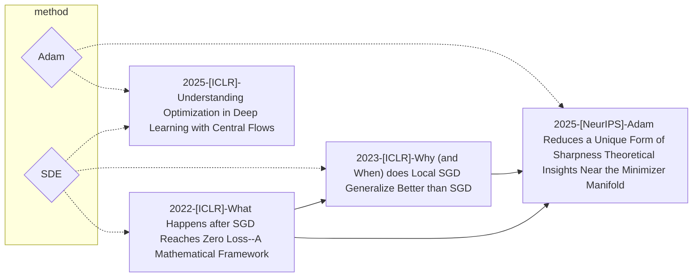

# Optimization Trajectory

- progressive shapening
- slow sde
- central flow, 能否用同样的time-average来估计谱的变换？
- adam ode 2025-ODE approximation for the Adam algorithm General and overparametrized setting
- valley-river
    - saddle cascade https://scottpesme.github.io/Articles/Neurips_s2s-CR.pdf
    - deep relu saddle https://arxiv.org/pdf/2505.21722
    - 感觉llm和其他loss差别还是挺大的，希望找到一些不变量
- saddle cascade
